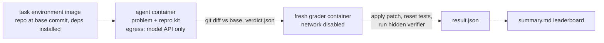

# Kairo-30

**30 real software-engineering environments from production AI infrastructure.**
Every task has a deterministic reproducer, a control, a failing invariant, real
repository history, and a verified outcome.

These are not synthetic mutations. Each task is a bug that kairo reproduced on
the wire in LiteLLM, NVIDIA Switchyard, Bifrost, NVIDIA Dynamo, any-llm, OGX, or
GoModel, pinned to the upstream commit where it existed. A coding agent gets the
real repository at that commit, a bug report, and a reproduction kit. It has to
find the defect and fix it. A hidden, offline verifier then drives the real
public entry point with inputs the agent never saw.

Kairo-30 also ships **10 no-bug tasks**: reports of bugs that kairo tried to
reproduce and could not, because the code is correct, the bug was already fixed
at that commit, or the gateway simply behaves better than its peers. The right
answer there is to say so and leave the source alone. Patch datasets rarely
measure this, and it is how an agent learns not to hallucinate a fix.

| | |
|---|---|
| Bug tasks (split `kairo-30`) | 30 |
| No-bug tasks (split `negatives`) | 10 |
| Projects | LiteLLM 7, Switchyard 10, Bifrost 7, any-llm 3, Dynamo 1, OGX 1, GoModel 1 |
| Languages | Python 12, Rust 10, Go 8 |
| Gold patches | 18 merged upstream fixes (4 hand-backported to the base), 4 open upstream PRs, 8 kairo reference fixes |
| Failure categories | request-field-drop, content-loss, stop-reason-mapping, stream-lifecycle, credential-boundary, tool-call-identity, state-and-history (plus crash in the no-bug split) |
| Grading | hidden fail-to-pass and pass-to-pass tests, offline, in a fresh container |

The full list, with upstream issues, fix PRs, and validation counts, is in
[`TASKS.md`](TASKS.md).

## Quick start

Requirements: Docker (Desktop or Engine), [uv](https://docs.astral.sh/uv/), and
about 45 GB of free disk for all environment images. No provider keys are needed
to build or validate anything; keys are only used by the agents under test.

```bash
cd bench
cp .env.example .env        # paste the keys for the agents you want to run
./kairo-bench doctor        # checks Docker, disk, and which agents have a key
./kairo-bench run           # every agent that has a key, all 40 tasks, one trial
```

`run` builds what it needs (task environments and the agent toolbox), runs the
agents, grades every attempt, and prints the leaderboard. Results land in
`bench/runs/<run-id>/`. Re-running with `--run-id <id>` resumes a run and skips
finished jobs.

Useful variations:

```bash
./kairo-bench run --agents claude-code,codex --trials 3 --jobs 4
./kairo-bench run --agents opencode:openrouter/qwen/qwen3-coder --split kairo-30
./kairo-bench run --agents mini-swe-agent:anthropic/claude-sonnet-5 --tasks litellm-,bifrost-
./kairo-bench run --no-repro            # issue-only mode: no reproduction kit
./kairo-bench report latest             # rebuild the leaderboard for the last run
./kairo-bench show litellm-085-responses-fallback-replays-tool-call   # the exact prompt
```

## Agents

| Agent | Selector | Keys it can use | Default model |
|---|---|---|---|
| Claude Code | `claude-code[:model]` | `ANTHROPIC_API_KEY` or `CLAUDE_CODE_OAUTH_TOKEN` | `claude-opus-5-5` |
| OpenAI Codex CLI | `codex[:model]` | `OPENAI_API_KEY` | CLI default |
| Gemini CLI | `gemini-cli[:model]` | `GEMINI_API_KEY` | CLI default |
| OpenCode | `opencode[:provider/model]` | any of the four provider keys | `anthropic/claude-sonnet-5` |
| mini-SWE-agent | `mini-swe-agent[:litellm-model]` | any of the four provider keys | `anthropic/claude-sonnet-5` |
| oracle | `oracle` | none | applies the gold patch (harness self-test) |
| noop | `noop` | none | changes nothing (harness self-test) |

Versions are pinned in [`agents.toml`](agents.toml). All CLIs are installed once
into a toolbox image and mounted read-only into every task container, so adding
an agent never rebuilds a task environment. Each agent runs headless with its
own permission prompts disabled, as the unprivileged `kairo` user, inside the
container. `oracle` must resolve every bug task and `noop` must resolve none;
running both is a quick end-to-end check of the harness.

## How a run works



1. **Environment.** `envs/<env>/Dockerfile` checks out the upstream repository at
   an exact commit with a shallow slice of real history before it and nothing
   after it (no remote, no tags, no future commits), installs pinned
   dependencies, and prebuilds compiled projects so an agent's rebuild is
   incremental. Several tasks share one environment.
2. **Agent.** The container gets the problem statement, the task's public
   reproduction kit in `/work/kairo`, and the prompt in
   [`prompts/task.md`](prompts/task.md). Its only network path is an allowlist
   proxy that permits the agent's model API and refuses everything else, so it
   cannot fetch the upstream fix from GitHub or a newer package from PyPI. The
   agent must write `/work/verdict.json` saying `bug` or `not-a-bug`.
3. **Patch.** The harness takes `git diff` of `/work/repo` against the base
   commit (honoring `.gitignore`) and the verdict, then deletes the container.
4. **Grading.** A new container from the same image, with networking disabled,
   applies the patch, restores the repository's own test files to the base
   commit, and runs the task's hidden verifier. The verifier starts the real
   gateway or SDK against a deterministic local upstream and writes named test
   results. A declared test that is missing counts as failed.

## Scoring

- A **bug task is resolved** when every hidden fail-to-pass test passes and every
  pass-to-pass test still passes.
- A **no-bug task is handled** when the agent answers `not-a-bug`, changes no
  source file (tests it adds are fine), and every hidden pass-to-pass test still
  passes.
- A **hallucinated fix** is a no-bug attempt where the agent reported a bug or
  changed source.
- With `--trials k`, the leaderboard reports the mean resolve rate and the
  number of tasks resolved in any trial (pass@k). Cost, tokens, and wall time
  come from each agent's own output where it reports them.

The hidden tests check invariants, not a particular implementation. For
example, the thinking-history task accepts replayed reasoning in any field of
the assistant message except the visible content, and the adaptive-thinking
task accepts either honoring the setting or refusing it with a 4xx before any
upstream call. Verifier inputs deliberately differ from the public reproducer
(different ids, texts, images, and tool names), and most tasks also run a slice
of the project's own unit tests as pass-to-pass checks.

## Verified outcomes

`kairo-bench validate` proves every verifier before any agent is scored: on the
unpatched base commit every fail-to-pass test must fail and every pass-to-pass
test must pass, and with the gold patch everything must pass. For a no-bug task
the base must pass everything. Each check is repeated and recorded under
[`validation/`](validation/) with the environment image id.

```bash
./kairo-bench validate --repeats 3 --jobs 3      # no keys needed
```

Gold patches come from three places, and each task says which:

- `upstream-merged`: the diff of the merged upstream fix, with its own test and
  doc changes removed. Four were backported by hand because a nearby hunk had
  moved; the task file says so.
- `upstream-open-pr`: the diff of an open upstream PR that fixes the bug.
- `kairo-reference`: a minimal fix written for this benchmark where no upstream
  fix exists. These follow the maintainers' own rules where there is one (for
  example litellm#34627 for the fallback task).

## Task anatomy

```
tasks/<id>/
  task.toml      metadata: repo, base commit, upstream links, category, difficulty,
                 gold source, verifier command, fail_to_pass and pass_to_pass test names
  problem.md     the bug report the agent sees
  public/        reproduction kit copied to /work/kairo (reproduce.sh, deterministic upstream)
  verifier/      hidden grading code, only ever copied into the grader container
  gold.patch     reference fix (bug tasks)
envs/<env>/      Dockerfile, pinned lock files, agent-notes.md
lib/             kairo_verify.py (results contract, deterministic upstream, process control)
                 and rigs/ (how to start each gateway)
```

To add a task: pick or add an environment, write `problem.md` as the report a
user would file, put the reproducer in `public/`, write `verifier/verify.py`
with `kairo_verify.Results`, list the test names in `task.toml`, add the gold
patch (`scripts/source-only-patch.py` strips tests and docs from an upstream
diff), add the id to a split, and run `./kairo-bench validate --tasks <id>
--repeats 3` until it passes. `python3 -m unittest discover -s bench/tests`
checks the catalog offline.

## Commands

| Command | What it does |
|---|---|
| `doctor` | Docker, disk, and per-agent key status |
| `list [--split S]` | tasks with kind, difficulty, category, gold source |
| `show TASK` | the exact prompt an agent receives |
| `build [--toolbox]` | build task environments ahead of a run |
| `validate` | prove each verifier (base fails, gold passes) |
| `run` | run agents, grade, print the leaderboard |
| `report [RUN]` | rebuild `summary.md` and `summary.json` for a run |
| `catalog` | regenerate `TASKS.md` |
| `clean`, `prune` | remove leftover containers, stale images, and build cache |

Each job directory in `runs/<id>/jobs/<agent>/<task>/trial-N/` keeps the prompt,
the agent's stdout and stderr, its session transcripts, `patch.diff`,
`verdict.json`, the verifier log and results, and `result.json`. The run
directory also keeps `egress.jsonl`, every allow or deny decision the proxy made.

## Limitations

- This PR ships the environments, tasks, verifiers, and harness. No agent has
  been scored yet, so there is no leaderboard in the repository.
- LiteLLM runs from source without its optional Rust bridge (`LITELLM_RUST=false`).
  Every verified route runs on its Python path; the upstream wheels would
  prefer the native path on some routes that these tasks do not exercise.
- Dynamo runs CPU-only, with the compiled `dynamo._core` extension replaced by an
  inert stub. The multimodal loader under test does not use it.
- Bifrost reads its pricing and model catalogs from bundled test data through
  its documented `file://` air-gapped mode.
- Environments are built from source for the host architecture. They were
  validated on linux/arm64 (Docker Desktop on Apple silicon); amd64 builds use
  the same Dockerfiles but were not validated in this PR.
- The egress allowlist relies on each CLI honoring `HTTPS_PROXY`. A CLI that
  ignores it cannot reach anything, because the agent network has no route out.
- Disk: besides about 45 GB of images, each concurrent Go or Rust job needs a
  few GB of scratch while it runs, because rebuilding copies part of the warm
  build cache into the container's writable layer. It is released when the
  container is removed. Lower `--jobs` on a small disk; `doctor` warns below
  40 GB free.
