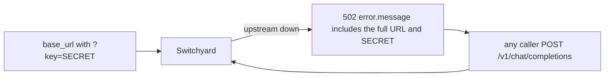

# 025, Switchyard 502s echo `base_url` including `?key=` API keys

- **Upstream**: no public ticket. NVIDIA `SECURITY.md` asks for mail to
  `psirt@nvidia.com` rather than a GitHub issue. `client_error` maps
  `LlmClientError::Transport` / `Timeout` to the client as
  `source.to_string()`. Reqwest's error text includes the full URL.
  Userinfo (`http://key@host`) is stripped in that text. Query
  parameters are not.
- **Tool under test**: Switchyard `switchyard-server` 0.2.0 (commit 2bef154).
- **Credential incident (local, this hunt)**: a 502 whose `base_url` was
  `http://127.0.0.1:19998/v1?key=<live secret>` returned the full
  Gemini, OpenAI, Anthropic, and OpenRouter keys 5/5 each. Header-auth
  live chats to those providers did not echo the keys. Transcripts are
  redacted (`transcripts/025/live-502-gemini-redacted.json`,
  `transcripts/025/live-real-results.json`). Rotate all four keys.
- **Reproduced**: 2026-08-14. Canary query-key echo 5/5. Live-key 502
  echo 5/5 per provider. Evidence: `transcripts/025/`.

## What breaks

An operator puts the provider key in the upstream URL, which is how
Google's Gemini REST API is documented (`?key=`) and how some
OpenAI-compatible Gemini `base_url`s are written. Any caller who
triggers a transport failure (connection refused, DNS, timeout) gets
HTTP 502 whose `error.message` is:

```
error sending request for url (http://127.0.0.1:19998/v1?key=CANARY_ADMIN_QUERY_KEY/chat/completions)
```

The deployment key is now in the client body. `/health`, `/v1/models`,
`/v1/stats`, and `/metrics` stay clean. A successful chat stays clean.
A 502 whose `base_url` has no query string also stays clean.

Who that hurts:

- Shared Switchyard: any tenant can read the admin Gemini/query key
  the moment the upstream is briefly unreachable. They can then call
  the provider directly.
- The same URL is what Switchyard actually POSTs. Live Gemini with
  `?key=CANARY` on a reachable host returned HTTP 404 without echoing
  the canary (Google did not put it in `error.message`). The client
  leak is the Switchyard-generated transport string, not Google's
  JSON.
- Header auth is safer here: `api_key_env` becomes `Authorization:
  Bearer ...`. A 502 for that config does not contain the bearer
  token. HTTP userinfo (`http://key@host`) is also stripped in the
  reqwest error. `?key=` is the hole they did not redact.



## Wire evidence

Three legs.

1. **Switchyard (base_url `http://127.0.0.1:19998/v1?key=CANARY_ADMIN_QUERY_KEY`, extra_headers Bearer also set)**
   - POST `/v1/chat/completions` HTTP 502. Message contains
     `CANARY_ADMIN_QUERY_KEY`. Does not contain
     `CANARY_ADMIN_HEADER_KEY`. 5/5.
     `transcripts/025/transport-query-key.json`.
   - Same 502 on stream and `/v1/messages`. 5/5.
     `transcripts/025/query-key-results.json`.
2. **Control**
   - Same shape, `base_url` with HTTP userinfo instead of a query key:
     `http://CANARY_ADMIN_USERINFO_KEY@127.0.0.1:19997/v1`. HTTP 502.
     URL in the message has no userinfo and no canary. 5/5.
     `transcripts/025/transport-control.json`.
   - Header-only auth against a live mock: HTTP 200, no canaries.
     `transcripts/025/chat-control.json`.
3. **Determinism / live**
   - Query-key canary 502 5/5.
   - Live header-auth chats, no key in the body: OpenAI `gpt-4o-mini`
     HTTP 200 5/5, Gemini `gemini-2.5-flash` HTTP 200 5/5, OpenRouter
     `openai/gpt-4o-mini` HTTP 200 5/5, Anthropic `claude-haiku-4-5`
     HTTP 200 5/5.
   - Live `?key=<real secret>` against a closed port: HTTP 502 contains
     the full Gemini, OpenAI, Anthropic, and OpenRouter keys. 5/5 each.
     `transcripts/025/live-502-gemini-redacted.json`.

## Root cause (in Switchyard source)

`libsy-llm-client/src/client.rs` `convert_reqwest_error` wraps the
reqwest error. `switchyard-server/src/lib.rs` `client_error` copies
`source.to_string()` into the JSON `error.message` for `Transport` and
`Timeout`. Reqwest includes the URL. Query parameters are part of that
URL. There is no redaction step.

`HttpBackendConfig`'s `Debug` impl redacts `api_key` but that path is
not what the client sees. The client sees the transport error.

## Test invariants

1. A client-visible error MUST NOT contain a `?key=` credential from
   `base_url`.
2. A 502 for a `base_url` without a query key, and a successful chat,
   MUST stay clean.

## Repro

```
# no server on 19998
switchyard-server --config transcripts/025/sy-query-key.toml --port 9000
curl -s localhost:9000/v1/chat/completions -H 'content-type: application/json' \
  -d '{"model":"captured-model","messages":[{"role":"user","content":"x"}],"max_tokens":8}'
# error.message contains CANARY_ADMIN_QUERY_KEY
```
