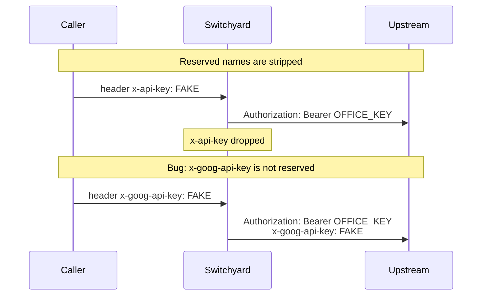

# 027, Switchyard forwards client `x-goog-api-key` the reserved list missed

- **Upstream**: [Switchyard#410](https://github.com/NVIDIA-NeMo/Switchyard/issues/410).
  Adjacent to 023: `RESERVED_HEADERS` in
  `libsy-llm-client/src/client.rs` strips `authorization`, `x-api-key`,
  and `cookie`. It does not strip `x-goog-api-key` (Google's credential
  header). 023 already froze `api-key` and `OpenAI-Organization`. This is
  the remaining provider-credential name on the same list.
- **Tool under test**: Switchyard `switchyard-server` 0.2.0 (commit 2bef154).
- **Not a credential incident**: probes used fake canaries. No real keys
  in the recorded bodies. No rotation needed.
- **Reproduced**: 2026-08-14. Header forward 5/5 on the capture rig.
  Authorization stays the deployment Bearer. Evidence:
  `transcripts/026/cap-sy-x-goog.jsonl`.

## What breaks

A Switchyard caller can send `x-goog-api-key`. That name is not reserved,
so `forward_metadata_headers` copies it onto the upstream request.
`apply_auth` then sets `Authorization: Bearer <config>` without removing
the extra.

Who that hurts:

- Gemini deployments that authenticate with `x-goog-api-key`: a client
  header of that name is forwarded next to the office Bearer. The mock
  shows it on the wire 5/5. 021's earlier live Gemini pass returned HTTP
  200 because Google preferred the Bearer; the leak is the header leaving
  the proxy, not an auth swap on that provider. A gateway that *does*
  prefer `x-goog-api-key` would treat the client value as the credential.
- JSON body `api_key`, `organization`, and `extra_headers` are copied
  into the outbound JSON 5/5 but do **not** become HTTP auth headers.
  OpenAI-compatible mocks ignore those fields (HTTP 200). Not frozen as
  the finding. The hole is the HTTP header.

The reserved list *does* still strip `Authorization` and `x-api-key`
(023's control). `x-goog-api-key` is the Google-shaped miss, the same
way `api-key` was the Azure-shaped miss.



## Wire evidence

Three legs.

1. **Switchyard (mock OpenAI at 127.0.0.1:9998, deployment `Bearer DEPLOYMENT_BEARER`)**
   - Client header `x-goog-api-key=CANARY_SY_X_GOOG` appears on the
     upstream request. `Authorization` stays `Bearer DEPLOYMENT_BEARER`.
     5/5. `transcripts/026/cap-sy-x-goog.jsonl`.
2. **Control**
   - Same Switchyard, no extra headers: no canaries.
     `transcripts/026/cap-sy-control.jsonl`.
   - Client JSON `api_key` / `organization` / `extra_headers` stay in the
     JSON body and do not replace Authorization. 5/5.
3. **Determinism**
   - Mock forward 5/5. Compact log: `transcripts/026/cap-sy.jsonl`.
   - Live Gemini auth-swap was already measured in the 021/023 pass:
     extra `x-goog-api-key` through Switchyard still HTTP 200 (Bearer
     wins). This freeze is the header on the wire.

## Root cause (in Switchyard source)

`libsy-llm-client/src/client.rs` `RESERVED_HEADERS` is a denylist.
Provider credential headers that are not on it are forwarded. 023 added
the Azure and OpenAI names to the kairo record. `x-goog-api-key` was
still missing.

## Test invariants

1. A client `x-goog-api-key` MUST NOT appear on the upstream request.
2. A request without that header MUST stay clean.

## Repro

```
python3 tools/capture_headers.py 9998 transcripts/026/cap-sy.jsonl
# switchyard-server --config transcripts/026/sy.toml --port 9000
curl -s localhost:9000/v1/chat/completions \
  -H 'content-type: application/json' \
  -H 'x-goog-api-key: CANARY_SY_X_GOOG' \
  -d '{"model":"captured-model","messages":[{"role":"user","content":"x"}],"max_tokens":8}'
# capture has header x-goog-api-key: CANARY_SY_X_GOOG
```
