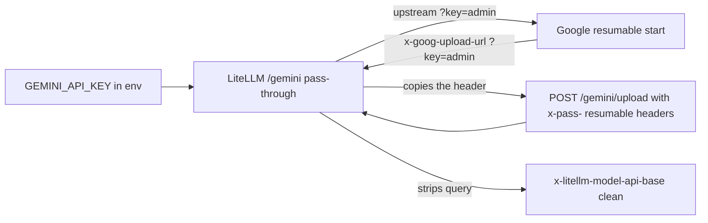

# 028, LiteLLM `/gemini` pass-through returns the env Gemini key in `x-goog-upload-url`

- **Upstream**: no public ticket. Adjacent to 024 (`/health` extra_headers)
  and to LiteLLM's own `x-litellm-model-api-base` strip of query strings
  ("don't include query params, risk of leaking sensitive info"). The
  pass-through copies `Location` / `x-goog-upload-url` /
  `x-goog-upload-control-url` in full. `x-pass-` always forwards headers
  whose names are not on `_PASS_THROUGH_PROTECTED_HEADERS`;
  `x-goog-upload-*` is not on that list.
- **Tool under test**: LiteLLM 1.96.2. Mock Gemini base
  (`transcripts/028/echo_upstream.py` on 9996) plus live Google AI Studio
  with `GEMINI_API_KEY` from `.env`.
- **Credential incident (local, this hunt)**: live
  `POST /gemini/upload/v1beta/files` with `x-pass-x-goog-upload-*`
  resumable-start headers returned the full Gemini key in
  `x-goog-upload-url` and `x-goog-upload-control-url` 5/5. Direct Google
  the same 5/5 (Google puts `?key=` on those URLs). Transcripts are
  redacted (`transcripts/028/live-upload-redacted.json`,
  `transcripts/028/round2-results.json`). Rotate `GEMINI_API_KEY`.
- **Reproduced**: 2026-08-14. Mock canary echo 5/5. Live Gemini key echo
  5/5. Evidence: `transcripts/028/`.

## What breaks

LiteLLM's Google AI Studio pass-through (`/gemini/{path}`) loads
`GEMINI_API_KEY` from the environment and sends it upstream as
`?key=`. Google's resumable file-upload start replies with
`X-Goog-Upload-URL` / `X-Goog-Upload-Control-URL` that include that
same query. LiteLLM copies those response headers to the caller.

`forward_headers` is off on this route, so a raw
`X-Goog-Upload-Protocol: resumable` from the client is dropped and
Google does a simple upload (no key in the response). The documented
`x-pass-` prefix strips and forwards the header anyway. A caller sends
`x-pass-x-goog-upload-protocol: resumable` (and the matching start
headers), LiteLLM injects the admin Gemini key, Google returns URLs
that contain it, and the caller reads the key out of the response
headers.

Default local proxy has no master key, so `user_api_key_auth` lets the
request through.

Who that hurts:

- Shared proxies: any tenant who can hit `/gemini/upload/v1beta/files`
  steals the admin Google key and can call Gemini directly.
- This is the deployment `api_key` itself, not an `extra_headers`
  leftover (024). `x-litellm-model-api-base` already strips `?`. These
  two Google headers were left off that strip.

Controls that stay clean:

- `POST /v1/chat/completions` (header auth, no query key).
- Plain `/gemini/upload` without the `x-pass-` resumable headers
  (Google completes a simple upload, no `x-goog-upload-url`).
- Closed-port pass-through 500 (`Cannot connect to host 127.0.0.1:1`).
  Unlike Switchyard 025, LiteLLM's pass-through `str(e)` does not echo
  `?key=`.
- `x-litellm-model-api-base` on the leak response itself is the URL
  without the query.



## Wire evidence

1. **LiteLLM mock** (`GEMINI_API_KEY=CANARY_GEMINI_PASSTHROUGH_KEY`,
   `GEMINI_API_BASE=http://127.0.0.1:9996`)
   - Echo upstream recorded
     `POST /upload/v1beta/files?key=CANARY_GEMINI_PASSTHROUGH_KEY`.
     `transcripts/028/cap-echo.jsonl`.
   - Client response headers
     `location` and `x-goog-upload-url` contain the canary. 5/5.
     `transcripts/028/pt-upload-leak.json`.
   - `x-litellm-model-api-base` is
     `http://127.0.0.1:9996/upload/v1beta/files` with no query.
2. **Control**
   - Mock chat completion: no canary.
     `transcripts/028/chat-control.json`.
   - Live plain upload (no `x-pass-` resumable headers): HTTP 200,
     file created, no key. 5/5.
     `transcripts/028/pt-upload-plain-control.json`.
   - Live chat `gemini-flash`: HTTP 200, no key. 5/5.
   - Closed-port pass-through with the live key:
     HTTP 500 `Cannot connect to host 127.0.0.1:1`. No key. 5/5.
     `transcripts/028/closed-port-control.json`.
3. **Live Google**
   - `POST /gemini/upload/v1beta/files` with
     `x-pass-x-goog-upload-protocol: resumable` and the matching start
     headers: HTTP 200, `x-goog-upload-url` and
     `x-goog-upload-control-url` contain the full `GEMINI_API_KEY`.
     5/5. `transcripts/028/live-upload-redacted.json`.
   - Direct Google the same headers, no LiteLLM: the same two URLs
     contain the key 5/5. LiteLLM did not invent `?key=` on Google's
     side. It injected the env key on the way in and copied Google's
     headers on the way out.

## Root cause (in LiteLLM source)

`proxy/pass_through_endpoints/llm_passthrough_endpoints.py`
`gemini_proxy_route` does `merged_params.update({"key": gemini_api_key})`
on every `/gemini/{path}` call.

`proxy/pass_through_endpoints/pass_through_endpoints.py`
`get_response_headers` copies every upstream header except
`transfer-encoding`, `content-encoding`, `content-length`, `server`,
`date`, `connection`, `keep-alive`. `location`, `x-goog-upload-url`,
and `x-goog-upload-control-url` are not in that list.

`proxy/common_request_processing.py` `get_custom_headers` strips `?`
from `x-litellm-model-api-base` only.

`passthrough/utils.py` `forward_headers_from_request` always honors
`x-pass-*` after stripping the prefix. Protected names are
`authorization`, `api-key`, `x-api-key`, `x-goog-api-key`, `host`,
`content-length`, and `x-amz-*`. `x-goog-upload-protocol` is not
protected, so a caller can force Google's resumable start on the
default route where `forward_headers` is false.

## Test invariants

1. A client-visible header MUST NOT contain the deployment Gemini key
   or a `?key=` canary.
2. Chat completions, a plain `/gemini/upload` without resumable
   headers, and a closed-port pass-through 500 MUST stay clean.

## Repro

```
python3 transcripts/028/echo_upstream.py 9996 transcripts/028/cap-echo.jsonl
# GEMINI_API_KEY=CANARY_GEMINI_PASSTHROUGH_KEY
# GEMINI_API_BASE=http://127.0.0.1:9996
# litellm --config transcripts/028/litellm-mock.yaml --port 4000
curl -sD - http://127.0.0.1:4000/gemini/upload/v1beta/files \
  -H 'x-pass-x-goog-upload-protocol: resumable' \
  -H 'x-pass-x-goog-upload-command: start' \
  -H 'content-type: application/json' \
  -d '{"file":{"display_name":"canary"}}'
```
