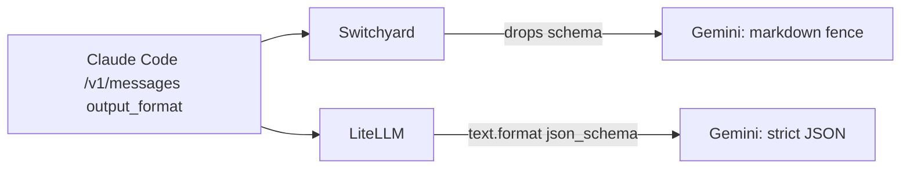

# 040, Switchyard drops Anthropic `output_format` (structured JSON)

- **Upstream**: no ticket. 006/032 family: a request field that vanishes in
  translation on one ingress and survives on another.
- **Tool under test**: Switchyard `switchyard-server` 0.2.0. Control:
  LiteLLM 1.96.2 on the same Anthropic ingress, plus Switchyard's own
  OpenAI `/v1/chat/completions` route, plus live Gemini 2.5 Flash and
  live Anthropic Haiku.
- **Reproduced**: 2026-08-17. Capture 5/5. Live Gemini 3/3. Evidence:
  `transcripts/040/`.

## What breaks

Claude Code and production agents speak Anthropic `/v1/messages`. Structured
output is how those agents keep a parser on the other side of the model:
`output_format: {type: json_schema, schema: ...}`. At volume this is the
difference between `{"city":"Paris","ok":true}` and a markdown fence the
caller cannot `json.loads`.

Switchyard's Anthropic ingress drops `output_format` entirely. The forwarded
OpenAI body is only `model`, `messages`, `max_completion_tokens`. HTTP 200,
no warning.

The same gateway's OpenAI route forwards `response_format.json_schema` intact.
LiteLLM's `/v1/messages` maps `output_format` onto Responses `text.format`
(`type: json_schema`, `strict: true`). So a mapping exists, on this machine,
and Switchyard simply does not apply it on the Claude Code path.

## Live difference (real keys)

Same prompt ("Return the city Paris and ok true."), same Gemini 2.5 Flash:

| Path | Body the caller gets | |
|---|---|---|
| LiteLLM `/v1/messages` | `{"city":"Paris","ok":true}` | 3/3 |
| Switchyard `/v1/messages` | ` ```json { "city": "Paris", "ok": true } ``` ` (one run truncated to ` ```json `) | 3/3 |
| Switchyard OpenAI ingress (capture) | `response_format` present | 5/5 |
| Direct Anthropic `stop_sequences` control | native field honored (`stop_reason=stop_sequence`) | 3/3 |

LiteLLM is the working translation. Switchyard is the loss. Direct Gemini
without a schema is not the control — the control is "the schema reached
the model."



## Wire evidence

1. **Switchyard Anthropic ingress** (`transcripts/040/sy-output-format-upstream.jsonl`)
   Forwarded keys: `max_completion_tokens`, `messages`, `model`. No
   `response_format`, no `json_schema`. 5/5.
2. **Control: Switchyard OpenAI ingress**
   (`transcripts/040/sy-openai-response-format-upstream.jsonl`)
   Forwards `response_format: {type: json_schema, json_schema: {name: city, ...}}`.
   5/5.
3. **Control: LiteLLM `/v1/messages`**
   (`transcripts/040/ll-output-format-upstream.jsonl`)
   Forwards Responses `text.format.type=json_schema` with the same schema.
   5/5. Live Gemini returns parseable JSON 3/3.

## Root cause

Switchyard's Anthropic→OpenAI request codec does not map `output_format` onto
`response_format`. The OpenAI-side field and the IR (`OutputParams.response_format`)
already exist. LiteLLM's documented `/v1/messages` → Responses mapping is the
working analogue.

## Test

`switchyard_drops_anthropic_output_format` (violation) and
`switchyard_openai_route_keeps_response_format` plus
`litellm_messages_keeps_output_format` (controls), using
`json_schema_forwarded`.

Invariant: *a client-supplied JSON schema appears in the request the gateway
forwards upstream.*

## Repro

```
python3 tools/capture_headers.py 9996 transcripts/040/cap.jsonl
# switchyard-server --config transcripts/040/sy-capture.toml --port 9004
curl -s localhost:9004/v1/messages -H 'anthropic-version: 2023-06-01' \
  -d '{"model":"captured-model","max_tokens":64,"output_format":{"type":"json_schema","schema":{"type":"object","properties":{"city":{"type":"string"}},"required":["city"]}},"messages":[{"role":"user","content":"ping"}]}'
# forwarded body has no json_schema
```
