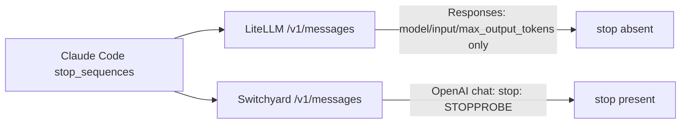

# 041, LiteLLM `/v1/messages` drops `stop_sequences`

- **Upstream**: LiteLLM's own docs
  ([v1/messages → /responses mapping](https://docs.litellm.ai/docs/anthropic_unified/messages_to_responses_mapping))
  list `stop_sequences` as "❌ Not mapped / Dropped silently." kairo 032 is
  the same loss on Bifrost. This freeze is LiteLLM on current 1.96.2.
- **Tool under test**: LiteLLM 1.96.2. Controls: the same proxy's
  `/v1/chat/completions` route, Switchyard's Anthropic ingress, and live
  Anthropic Haiku (native `stop_reason=stop_sequence`).
- **Reproduced**: 2026-08-17. Capture 5/5. Evidence: `transcripts/040/`.

## What breaks

Claude Code is pointed at a LiteLLM proxy with `ANTHROPIC_BASE_URL`. Agents
use `stop_sequences` as a hard generation boundary: cut the output the
moment this string appears. LiteLLM's Anthropic ingress internally routes
through OpenAI `/v1/responses` and forwards only `model`, `input`,
`max_output_tokens`. The stop token is gone. HTTP 200, no warning.

The same LiteLLM process, entered through `/v1/chat/completions` with
`stop: ["STOPPROBE"]`, forwards `stop` intact. Switchyard's Anthropic
ingress maps `stop_sequences` → `stop` 5/5. Direct Anthropic honors the
field (`stop_reason: stop_sequence` 3/3). So this is not "the backend
cannot stop." It is "this ingress forgets to ask."

Live Gemini is a weak behavioral control here: Gemini's OpenAI-compat
`stop` often returns an empty assistant message (0 completion tokens)
whether or not the gateway forwarded the field. The capture is the
ground truth.



## Wire evidence

1. **LiteLLM `/v1/messages`** (`transcripts/040/ll-stop-upstream.jsonl`)
   Path `/v1/responses`. Keys: `model`, `input`, `max_output_tokens`.
   User text is `hi` (so `STOPPROBE` is not smuggled in the prompt).
   `STOPPROBE` is absent 5/5.
2. **Control: LiteLLM `/v1/chat/completions`**
   (`transcripts/040/ll-openai-stop-upstream.jsonl`)
   Forwards `stop: ["STOPPROBE"]` 5/5.
3. **Control: Switchyard `/v1/messages`**
   (`transcripts/040/sy-stop-upstream.jsonl`)
   User text is `hi` (so `STOPPROBE` is not in the prompt).
   Forwards `stop: ["STOPPROBE"]` 5/5.
4. **Control: direct Anthropic**
   `stop_reason: stop_sequence` 3/3 on Haiku with the same token.

## Root cause

LiteLLM's `/v1/messages` → Responses translator does not map
`stop_sequences`. Documented as dropped. The Chat Completions path has
the field. Switchyard already performs the mapping the LiteLLM Anthropic
path skips.

## Test

`litellm_messages_drops_stop_sequences` (violation) and
`litellm_openai_route_keeps_stop_sequences` plus
`switchyard_messages_keeps_stop_sequences` (controls), using the existing
`stop_sequence_forwarded` checker.

Invariant: *a client-supplied stop sequence appears in the request the
gateway forwards upstream.*

## Repro

```
# LiteLLM --config transcripts/040/litellm.yaml --port 4008
# mock that accepts /v1/responses
curl -s localhost:4008/v1/messages -H 'anthropic-version: 2023-06-01' \
  -d '{"model":"mock","max_tokens":32,"stop_sequences":["STOPPROBE"],"messages":[{"role":"user","content":"hi"}]}'
# forwarded Responses body has no STOPPROBE
```
