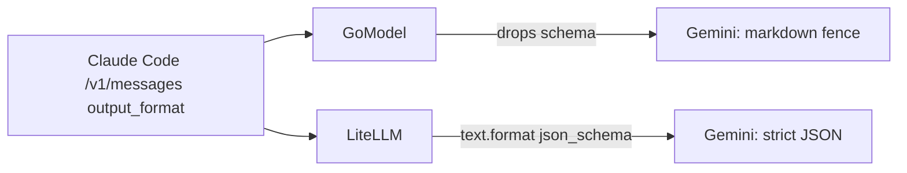

# 042, GoModel drops Anthropic `output_format` (structured JSON)

- **Upstream**: no ticket. Same class as kairo 040 (Switchyard drops this
  field; LiteLLM `/v1/messages` maps it). GoModel is the third gateway to
  lose it on the Claude Code path.
- **Tool under test**: ENTERPILOT/GoModel **0.1.77** (`abde73ca`). Control:
  the same process's OpenAI `/v1/chat/completions` route, plus live Gemini
  2.5 Flash through GoModel `/v1/messages`.
- **Reproduced**: 2026-08-17. Capture 5/5. Live Gemini 3/3. Evidence:
  `transcripts/042/`.

## What breaks

Claude Code and production agents speak Anthropic `/v1/messages`. Structured
output is how those agents keep a parser on the other side of the model:
`output_format: {type: json_schema, schema: ...}`. At volume this is the
difference between `{"city":"Paris","ok":true}` and a markdown fence the
caller cannot `json.loads`.

GoModel's docs call `/v1/messages` a drop-in for Anthropic SDKs. They list
`top_k` as dropped. They do not mention `output_format`. The Anthropic
ingress drops it entirely. The forwarded OpenAI body is only `model`,
`messages`, `max_tokens`. HTTP 200, no warning.

The same gateway's OpenAI route forwards `response_format.json_schema`
intact. LiteLLM's `/v1/messages` already maps the same field onto Responses
`text.format` (kairo 040). So a mapping exists, on this machine, and
GoModel does not apply it on the Claude Code path.

## Live difference (real keys)

Same prompt ("Return the city Paris and ok true."), same Gemini 2.5 Flash,
entered through GoModel `/v1/messages` with `output_format`:

| Run | Body the caller gets | `stop_reason` |
|---|---|---|
| 1 | ` ```json ` | `max_tokens` |
| 2 | fenced `{"city":"Paris","ok":true}` | `end_turn` |
| 3 | truncated fence | `max_tokens` |

Same unconstrained pattern as Switchyard 040. LiteLLM on the same prompt
returns unfenced `{"city":"Paris","ok":true}` 3/3.



## Wire evidence

1. **GoModel Anthropic ingress** (`transcripts/042/gm-output-format-upstream.jsonl`)
   Forwarded keys: `max_tokens`, `messages`, `model`. No `response_format`,
   no `json_schema`. User text is `hi`. 5/5.
2. **Control: GoModel OpenAI ingress**
   (`transcripts/042/gm-openai-response-format-upstream.jsonl`)
   Forwards `response_format: {type: json_schema, json_schema: {name: city, ...}}`.
   5/5.

## Root cause

GoModel translates `/v1/messages` through its canonical chat type. The
OpenAI-side `response_format` field already exists and is forwarded on
`/v1/chat/completions`. The Anthropic ingress does not map `output_format`
onto that field.

## Test

`gomodel_drops_anthropic_output_format` (violation) and
`gomodel_openai_route_keeps_response_format` (control), using
`json_schema_forwarded` (the checker written for kairo 040).

Invariant: *a client-supplied JSON schema appears in the request the gateway
forwards upstream.*

## Repro

```
# capture mock on 9996, then:
# GOMODEL_MASTER_KEY=kairo-gm OPENAI_API_KEY=sk-x \
#   OPENAI_BASE_URL=http://127.0.0.1:9996/v1 gomodel
# (cwd with transcripts/042/config.yaml)
curl -s localhost:8080/v1/messages \
  -H 'authorization: Bearer kairo-gm' \
  -H 'anthropic-version: 2023-06-01' \
  -d '{"model":"openai/captured-model","max_tokens":64,"output_format":{"type":"json_schema","schema":{"type":"object","properties":{"city":{"type":"string"}},"required":["city"]}},"messages":[{"role":"user","content":"hi"}]}'
# forwarded body has no json_schema
```
