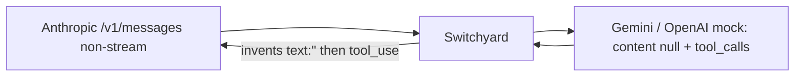

# 045, Switchyard invents an empty text block before every non-stream tool_use

- **Upstream**: no ticket. Sibling of kairo 009 (LiteLLM Responses phantom
  empty message). Anthropic Messages dialect.
- **Tool under test**: Switchyard `switchyard-server` 0.2.0, Anthropic
  `/v1/messages` ingress, OpenAI-shaped backend (capture mock and live
  Gemini 2.5 Flash).
- **Reproduced**: 2026-08-17. Canned mock 3/3. Live Gemini 3/3. Evidence:
  `transcripts/045/`.
- **Not a credential incident**: no keys in the frozen files.

## What breaks

Claude Code and the Anthropic SDK speak `/v1/messages`. When the backend is
OpenAI-shaped (Gemini's OpenAI-compat endpoint, a capture mock, Kimi via
OpenRouter), a tool-only turn arrives upstream as:

```
message.content = null
message.tool_calls = [{name: Read, ...}]
```

Switchyard's non-stream translator emits:

```json
"content": [
  {"type": "text", "text": ""},
  {"type": "tool_use", "id": "...", "name": "Read", "input": {"file_path": "..."}}
]
```

The empty text block is fabricated. Direct Gemini has no `content` field at
all. Switchyard pointed at real Anthropic Haiku (same-format control) emits
only `tool_use`. Anthropic's own API never sends an empty text block on a
tool-only turn.



## Production coding path that does NOT break

Claude Code streams. Live Gemini through Switchyard `/v1/messages` with
`stream: true` starts at `content_block_start` `tool_use` 3/3. No empty text
event. `stop_reason: tool_use`. Read args are the real README path. Cursor's
OpenAI `/v1/chat/completions` path is also clean 3/3 on gpt-4o-mini once the
tool schema is not `strict` with a partial `required` list.

So: the Claude Code volume path (stream) works. The non-stream Anthropic SDK
path (Python `messages.create`, many eval harnesses, cheaper agent loops)
gets a phantom empty assistant turn on every tool call.

## Wire evidence

1. **Canned OpenAI mock** (`transcripts/045/phantom-empty-text.json`)
   Upstream `content: null` + two tool_calls. Client:
   `[{text:""}, Read, Grep]`. 3/3.
2. **Live Gemini 2.5 Flash** (`transcripts/045/gemini-nonstrm-phantom.json`)
   Same empty text then Read. `stop_reason: tool_use`. file_path is
   `/Users/atharva/kairo/README.md`. 3/3. Parallel Read+Grep also prefixes
   the empty text 3/3.
3. **Control: Switchyard → Anthropic Haiku** (`transcripts/045/anthropic-haiku-tool-only.json`)
   Same client tools, same prompt, same-format backend. Content is
   `[tool_use]` only. 3/3.
4. **Control: live Gemini stream** (`transcripts/045/gemini-stream-clean.sse`)
   First block is `tool_use` Read. No empty text event. 3/3.

## Also confirmed this hunt (not new)

| Probe | Result |
|---|---|
| Anthropic ingress sanitizes `functions.Read:0` → `functions_Read_0` | 005, still live on Kimi `/v1/messages` 3/3 |
| OpenAI ingress keeps `functions.Read:0` | 044 leftover, honest negative 3/3 live Kimi |
| `disable_parallel_tool_use` dropped | 017 |
| `cache_control` on the last tool dropped | 006 |
| `is_error` dropped on tool_result | 006 |
| Write contents with newlines survive encode | honest negative |
| Gemini parallel Read+Grep live | 3/3, args correct |
| Gemini multi-turn replays the Gemini id | tool_result is seen (model quotes README) |
| Cursor OpenAI Read live (no strict) | 3/3 Switchyard = direct |

## Why it matters

Non-stream Anthropic clients walk `content` in order. An empty text block
is an assistant turn with nothing in it: some UIs render a blank bubble,
some parsers that take `content[0]` as the reply get `""` and ignore the
following `tool_use`. Silent, HTTP 200. Streaming Claude Code is not hit.

## Test

`no_empty_text_alongside_tool_use`. Invariant: *if an Anthropic Messages
body (JSON or SSE) contains `tool_use`, it must not also contain a text
block whose text is empty.* Tests match the specific reason string, so a
parse error cannot pass as this finding, and each control fixture is
required to still carry `tool_use`.

`switchyard_nonstrm_invents_empty_text_before_tool_use` (violation, canned),
`switchyard_live_gemini_nonstrm_invents_empty_text` (violation, live),
`switchyard_anthropic_passthrough_has_no_empty_text` (control),
`switchyard_live_gemini_stream_has_no_empty_text` (stream control).
