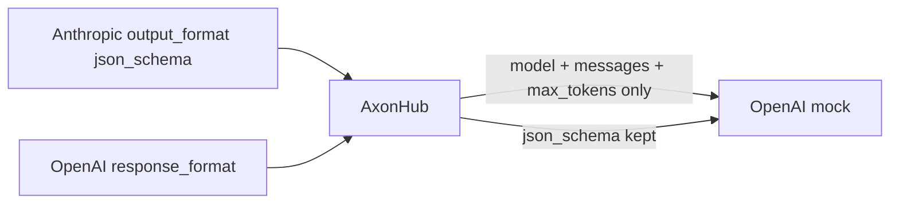

# 051, AxonHub drops Anthropic `output_format` (structured JSON)

- **Upstream**: no ticket, not yet filed. Same class as kairo 040
  (Switchyard) and 042 (GoModel). Third gateway to lose this field on
  the Claude Code path. LiteLLM `/v1/messages` is the working control
  in 040, not a fourth dropper.
- **Tool under test**: looplj/axonhub **v1.0.0-beta7** (`b4d1fd04`).
  Anthropic `/v1/messages` ingress, OpenAI-shaped capture mock.
  Control: the same process's OpenAI `/v1/chat/completions` route.
- **Reproduced**: 2026-08-17. Capture 5/5. Evidence: `transcripts/051/`.
- **Not a credential incident**: no keys in the frozen files.

## What breaks

Claude Code and production agents speak Anthropic `/v1/messages`.
Structured output is how those agents keep a parser on the other side
of the model: `output_format: {type: json_schema, schema: ...}`. At
volume this is the difference between `{"city":"Paris","ok":true}` and
a markdown fence the caller cannot `json.loads`.

AxonHub's docs present `/v1/messages` and `/anthropic/v1/messages` as
the way to "use the Anthropic SDK to call GPT". The Anthropic ingress
drops `output_format` entirely. The forwarded OpenAI body is only
`model`, `messages`, `max_tokens`. HTTP 200, no warning.

The same gateway's OpenAI route forwards `response_format.json_schema`
intact 5/5. LiteLLM `/v1/messages` already maps this field (kairo 040).
A mapping exists on this machine. AxonHub does not apply it on the
Claude Code path.



## Wire evidence

1. **AxonHub Anthropic ingress**
   (`transcripts/051/ah-output-format-upstream.jsonl`)
   Forwarded keys: `messages`, `model`, `max_tokens`. No
   `response_format`, no `json_schema`, no `output_format`. User text
   is `hi`. 5/5.
2. **Control: AxonHub OpenAI ingress**
   (`transcripts/051/ah-chat-format-upstream.jsonl`)
   Forwards `response_format: {type: json_schema, json_schema: {name:
   city, ...}}`. 5/5.

## Root cause

AxonHub translates `/v1/messages` onto an OpenAI-shaped backend. The
OpenAI-side `response_format` field already exists and is forwarded on
`/v1/chat/completions`. The Anthropic ingress does not map
`output_format` onto that field.

## Test

`axonhub_drops_anthropic_output_format` (violation) and
`axonhub_openai_route_keeps_response_format` (control), using
`json_schema_forwarded` (the checker written for kairo 040). Both tests
walk every jsonl record via `capture_records` (5/5, not just line 1).
The control then strips `response_format` on each record and requires
`JSON_SCHEMA_ABSENT`, so a fixture that lost its schema fails instead
of a silent false green.

Invariant: *a client-supplied JSON schema appears in the request the
gateway forwards upstream.*

## Repro

AxonHub stores channels in sqlite (`~/.config/axonhub/` by default).
That DB is local and is not in git. Create an OpenAI channel in the
admin UI or GraphQL: `baseURL` `http://127.0.0.1:9998/v1`, API key
`sk-x`, supported model `captured-model`, then enable it and mint an
AxonHub API key. The mock and both curls are:

```
python3 tools/mock_upstream.py 9998 /tmp/ah-cap.jsonl transcripts/051/canned-ok.json

# violation (frozen fixture uses max_tokens 64)
curl -s localhost:8090/v1/messages \
  -H "authorization: Bearer ${AXONHUB_KEY}" \
  -H 'anthropic-version: 2023-06-01' \
  -d '{"model":"captured-model","max_tokens":64,"output_format":{"type":"json_schema","schema":{"type":"object","properties":{"city":{"type":"string"}},"required":["city"]}},"messages":[{"role":"user","content":"hi"}]}'

# control (frozen fixture uses max_tokens 16)
curl -s localhost:8090/v1/chat/completions \
  -H "authorization: Bearer ${AXONHUB_KEY}" \
  -d '{"model":"captured-model","max_tokens":16,"messages":[{"role":"user","content":"hi"}],"response_format":{"type":"json_schema","json_schema":{"name":"city","schema":{"type":"object","properties":{"city":{"type":"string"},"ok":{"type":"boolean"}},"required":["city","ok"],"additionalProperties":false},"strict":true}}}'
```

The violation forwarded body has no `json_schema`. The control
forwards `response_format.json_schema`.
