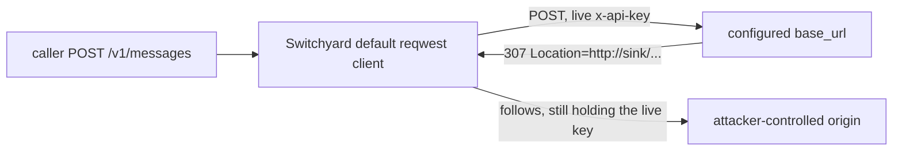

# 063, Switchyard follows HTTP redirects with Anthropic and Google API keys

- **Upstream**: no public ticket. NVIDIA `SECURITY.md` asks for mail to
  `psirt@nvidia.com` rather than a GitHub issue. Credential leakage is
  in scope. Adjacent: they already disable redirects on the
  `forward_auth` HTTP client because "A redirect could move
  provider-specific headers to another origin." The default
  `api_key_env` client still follows redirects.
- **Tool under test**: Switchyard `switchyard-server` 0.2.0 (kairo
  binary, 2026-08-12).
- **Credential incident (local, this hunt)**: a 307 from the configured
  `base_url` to another origin delivered the live Anthropic key in
  `x-api-key` 5/5 (`api_key_env` and `extra_headers`) and the live
  Gemini key in `extra_headers.x-goog-api-key` 5/5. The live OpenAI
  Bearer was present on the origin hop and stripped on the sink 5/5.
  Transcripts are redacted (`REDACTED_ANTHROPIC_API_KEY`,
  `REDACTED_GEMINI_API_KEY`, `REDACTED_OPENAI_API_KEY`). Rotate
  Anthropic and Gemini keys used in this hunt.
- **Reproduced**: 2026-08-19. Live keys, local 307 pair, HTTP 200.
  Evidence: `transcripts/063/`.

## What breaks

Switchyard's default `reqwest` client follows HTTP 307 to another
origin. Reqwest strips `Authorization` on that hop. It does not strip
`x-api-key` or `x-goog-api-key`.

Anthropic auth is `x-api-key`, not Bearer. A 307 from the configured
`base_url` to a different host therefore carries the live Anthropic
deployment key. Gemini deployments that put the Google key in
`extra_headers.x-goog-api-key` (common next to a Bearer) leak that
header the same way, even while the Bearer is dropped.

Who that hurts:

- Any Anthropic (or Anthropic-compatible) target whose `base_url`
  307/308s off-origin: corporate reverse proxies, HTTP to a different
  host, an open redirect on the first hop, a compromised first hop.
  The second origin gets `x-api-key` and can call Anthropic as the
  operator.
- Gemini `extra_headers.x-goog-api-key`: the Google key arrives at the
  redirect target; the OpenAI-shaped Bearer does not. Same process,
  two headers, only one is protected.
- Shared Switchyard: a caller who can make the configured upstream
  return a 307 (or who waits for a misconfigured gateway to do it)
  collects the office key. HTTP 200. No error to the client.

The `forward_auth` path already refuses to follow redirects. That is
the control that shows they know this class. `api_key_env` and
`extra_headers` were left on the following client.



## Wire evidence

Three legs. Live keys from the repo `.env`. Captures redacted before
commit. Scoreboard: `transcripts/063/live-real-scoreboard.json`.

1. **Switchyard Anthropic (0.2.0)**
   - `api_key_env = ANTHROPIC_API_KEY`. Origin `127.0.0.1:19420` 307 to
     `127.0.0.1:19421`. Sink `x-api-key` is the live Anthropic key.
     Client HTTP 200. 5/5. `FULL:ANTHROPIC_API_KEY` on the sink. The
     client body has no key.
     `transcripts/063/live-anth-api-key-env-sink.jsonl`.
   - Same live key via `extra_headers.x-api-key`. Sink still holds it.
     HTTP 200. 5/5.
     `transcripts/063/live-anth-extra-header-sink.jsonl`.
2. **Control: live OpenAI Bearer on the same 307 shape**
   - `api_key_env = OPENAI_API_KEY`. Origin hop has
     `Authorization: Bearer` with the live OpenAI key (`FULL:OPENAI_API_KEY`).
     Sink hop has no `Authorization`. HTTP 200. 5/5.
     `transcripts/063/live-openai-bearer-origin.jsonl`,
     `transcripts/063/live-openai-bearer-sink.jsonl`.
   - Same process, live Gemini extra header: origin has Bearer and
     `x-goog-api-key`. Sink has `x-goog-api-key` only
     (`FULL:GEMINI_API_KEY`). HTTP 200. 5/5.
     `transcripts/063/live-goog-extra-header-origin.jsonl`,
     `transcripts/063/live-goog-extra-header-sink.jsonl`.
3. **Determinism**
   - Distinct ports, so the Location is a different origin.
   - `api_key_env` and `extra_headers` both leak the live Anthropic key.
     This is the header name, not one config spelling.

## Root cause (in Switchyard source)

`crates/libsy-llm-client/src/client.rs`:

- Default client: `reqwest::Client::builder()` (follows redirects).
- `forward_auth` client: `.redirect(Policy::none())` with the comment
  that a redirect could move provider-specific headers to another
  origin.
- `Backend::apply_auth` sets Anthropic `x-api-key`. OpenAI uses
  `bearer_auth` (`Authorization`). Reqwest treats Authorization as
  sensitive on cross-origin redirects. `x-api-key` and
  `x-goog-api-key` are ordinary headers.

`apply_extra_headers` copies TOML `extra_headers` onto the same
following client, so a Gemini `x-goog-api-key` extra header takes the
same path.

## Test

`upstream_omits_header_value` on the redacted sink capture. The
invariant: a cross-origin follow MUST NOT still hold the provider key.

- `switchyard_redirect_sink_keeps_live_anthropic_api_key` (violation)
- `switchyard_redirect_sink_keeps_live_anthropic_extra_header` (violation)
- `switchyard_redirect_sink_keeps_live_goog_extra_header` (violation)
- `switchyard_redirect_sink_strips_live_openai_bearer` (control: origin
  has the live Bearer, sink does not)
- `switchyard_redirect_live_scoreboard_5_of_5` (live N/N)

## How to reproduce

Needs a local `switchyard-server` (kairo 0.2.0 binary) and live keys in
the repo `.env`: `ANTHROPIC_API_KEY`, `OPENAI_API_KEY`, `GEMINI_API_KEY`.
The script redacts before writing under `transcripts/063/`. Rotate
those keys after you run it.

```bash
# from the kairo repo root
export SWITCHYARD_BIN=/path/to/switchyard-server
python3 transcripts/063/live_real.py
```

Expected on stdout:

```
repeat 5
sy_anth_api_key_env     n=5  status=[200]  sink=['FULL:ANTHROPIC_API_KEY']
sy_anth_extra_header    n=5  status=[200]  sink=['FULL:ANTHROPIC_API_KEY']
sy_openai_bearer        n=5  status=[200]  sink=[]
sy_goog_extra_header    n=5  status=[200]  sink=['FULL:GEMINI_API_KEY']
```

What the script starts, per provider:

1. `redirect_pair.py` sink on one port (records request headers, returns a canned 200).
2. `redirect_pair.py` origin on another port (records, replies HTTP 307 to the sink). Distinct ports, so the Location is a different origin.
3. `switchyard-server` with a temp toml. Anthropic `api_key_env` reads
   `ANTHROPIC_API_KEY`. Gemini `extra_headers.x-goog-api-key` is the
   live `GEMINI_API_KEY`. OpenAI `api_key_env` reads `OPENAI_API_KEY`.
4. Five POSTs into Switchyard. Frozen checkers look at the redacted
   sink capture and at `live-real-scoreboard.json`.

Or `./transcripts/063/repro.sh`.

Frozen checkers (no Switchyard binary, no keys):

```bash
cargo test --test conformance switchyard_redirect
```
