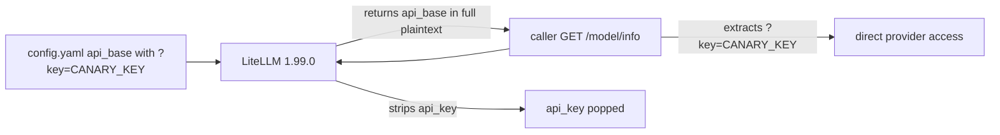

# 071, LiteLLM GET /model/info returns deployment `api_base` query credentials

- **Upstream**: Discussed by [litellm#18818](https://github.com/BerriAI/litellm/issues/18818), which changed `remove_sensitive_info_from_deployment`, but no dedicated `api_base` ticket was found. The docstring on `/model/info` and `/v1/model/info` (`proxy_server.py:13980`) explicitly promises to omit `api_base`: `"Provides more info about each model in /models, including config.yaml descriptions (except api key and api base)"`. In code, `api_key` is popped, but `api_base` is never popped or stripped.
- **Tool under test**: LiteLLM 1.99.0 (`tools/litellm-env`) and current release 1.100.0 (isolated temporary environment).
- **Reproduced**: 2026-09-05; refreshed 2026-09-06 on both versions. Canary echo 5/5 per affected route and clean controls 5/5 with `transcripts/071/litellm-leak.yaml`. Evidence: `transcripts/071/` and `transcripts/071/current-1.100.0/`.

## What breaks

An administrator or operator configures a model deployment with credentials embedded in `api_base`, such as a Google AI Studio OpenAI-compatible endpoint ending in `?key=...`.

On the tested default local configuration without a master key, any network client that can reach the proxy can call `GET /model/info` or `GET /v1/model/info`. LiteLLM returns `litellm_params.api_base` in unredacted plaintext.

Authenticated non-admin access was not tested and is not claimed here.

Who that hurts:

- Default local proxies reachable by an untrusted client: the client obtains the backend provider's full `api_base` URL and its query credential. Reusing that URL can bypass proxy rate limits, budgets, and audit logging. The reproduction measures disclosure of a synthetic canary; direct provider use is an inferred consequence and does not use a live provider key.

`/v1/models` and `/health/liveliness` do not return `litellm_params` or deployment endpoints. Those serve as the controls.



## Wire evidence

Each JSON fixture is a capture envelope (`{"request_path", "status", "body"}`)
cross-checked against the actual request line, status, Content-Length, and JSON
body in its `.http` exchange. Swapped routes, non-200 responses, and mismatched
bodies fail before the leak assertion.

1. **LiteLLM (mock deployment with query key in `api_base`)**
   - `GET /model/info` returns `litellm_params.api_base="http://127.0.0.1:9996/v1?key=CANARY_QUERY_KEY_IN_API_BASE"` in full. `api_key` is absent. 5/5. Envelope: `transcripts/071/model-info.json`. Raw HTTP: `transcripts/071/model-info.http`.
   - `GET /v1/model/info` returns the identical leak. 5/5. Envelope: `transcripts/071/model-info-v1.json`. Raw HTTP: `transcripts/071/model-info-v1.http`.
2. **Control**
   - `GET /v1/models` returns model list with standard metadata only. No `api_base` and no canary anywhere in the body (whole-body control). 5/5. Envelope: `transcripts/071/models-control.json`. Raw HTTP: `transcripts/071/models-control.http`.
   - `GET /health/liveliness` returns `"I'm alive!"` with no configuration parameters (whole-body control). 5/5. Envelope: `transcripts/071/liveliness-control.json`. Raw HTTP: `transcripts/071/liveliness-control.http`.
3. **Determinism**
   - 5/5 across all runs. Compact test summary: `transcripts/071/client-results.json`.

**Evidence refresh, 2026-09-06**: all four `.http` exchanges were regenerated
through a raw socket against the real LiteLLM 1.99.0 CLI. They contain literal
sent/received bytes with CRLF framing, not reconstructed headers. The runner
checks the installed version, rejects occupied ports, monitors process exit,
and runs with an allowlisted environment in a fresh working directory.
`PYTHON_DOTENV_DISABLED=1` also blocks dotenv discovery from the installed module
tree; changing cwd alone does not stop LiteLLM from finding the repository's
`.env`. A real CLI bootstrap audit blocks any attempted `.env` open before the
file can be read, with a failing control when dotenv is enabled.
All status and determinism checks run before any fixture writes, including
under `python3 -O`. Replacements are atomic per file, not across the whole
batch on filesystem errors. See `testing/issue-071-litellm-model-info-api-base-leak.md`.

## Upstream status

Checked 2026-09-06. The original 1.99.0 runtime remains the default pin. The latest
[release v1.100.0](https://github.com/BerriAI/litellm/releases/tag/v1.100.0), published
2026-09-06 at 05:33 UTC, was also installed and executed. Both affected routes
still disclose the canary 5/5; both controls remain clean 5/5. Its tag resolves to
`e4f25265704e2b2c6cf6e81be2e4c5cffff896f4`. Current-version captures and the exact
reproduction method are in `transcripts/071/current-1.100.0/README.md`.

Searches covered open and closed issues and PRs using `api_base` + `model/info`,
with `leak`, `redact`, and `query` variants, plus
`remove_sensitive_info_from_deployment` and `except api key and api base`.
The latter sanitizer search returned seven discussions, including
[#18818](https://github.com/BerriAI/litellm/issues/18818) (closed, `extra_headers`)
and [#26513](https://github.com/BerriAI/litellm/pull/26513) (merged, plural
`vertex_ai_credentials` redaction). Neither fixes the query credential in
`api_base`. The 1.100.0 release notes include
[#37090](https://github.com/BerriAI/litellm/pull/37090), which fixes the adjacent
`/health` field leak, not this model-info exposure.

Also inspected the [tagged sanitizer](https://github.com/BerriAI/litellm/blob/e4f25265704e2b2c6cf6e81be2e4c5cffff896f4/litellm/proxy/common_utils/openai_endpoint_utils.py#L15-L49),
its five latest commits through the tag, and the
[release changelog](https://github.com/BerriAI/litellm/compare/v1.99.0...v1.100.0).
The sanitizer still preserves `api_base`. No dedicated query-credential ticket
was found in these searches. Classification remains `discussed-no-ticket`.

## Root cause (in LiteLLM source)

In `proxy_server.py:13980`:
```python
async def model_info_v1(
...
):
    """
    Provides more info about each model in /models, including config.yaml descriptions (except api key and api base)
    ...
```
The docstring explicitly specifies that `api_base` should be excluded alongside `api_key`.

However, the sanitization logic in `litellm/proxy/common_utils/openai_endpoint_utils.py` is:
```python
def remove_sensitive_info_from_deployment(
    deployment_dict: dict,
    excluded_keys: set[str] | None = None,
) -> dict:
    deployment_dict["litellm_params"].pop("api_key", None)
    deployment_dict["litellm_params"].pop("client_secret", None)
    deployment_dict["litellm_params"].pop("vertex_credentials", None)
    deployment_dict["litellm_params"].pop("vertex_ai_credentials", None)
    deployment_dict["litellm_params"].pop("aws_access_key_id", None)
    deployment_dict["litellm_params"].pop("aws_secret_access_key", None)

    deployment_dict["litellm_params"] = SENSITIVE_DATA_MASKER.mask_dict(
        deployment_dict["litellm_params"], excluded_keys=_excluded
    )

    return deployment_dict
```
`api_base` is never popped, so it is returned verbatim.

In contrast, `_strip_admin_only_fields_from_health_result` in `proxy/health_endpoints/_health_endpoints.py` specifically removes `api_base` and `api_version` for non-admin callers on `/health`.

## Test invariants

1. A client-visible `GET /model/info` or `GET /v1/model/info` body MUST NOT contain query keys or authentication tokens in `litellm_params.api_base`.
2. `/v1/models` and `/health/liveliness` MUST stay clean of deployment parameters.

## Repro

```bash
# Start LiteLLM with reproduction configuration:
tools/litellm-env/bin/litellm --config transcripts/071/litellm-leak.yaml --port 4010

# In another terminal:
curl -s http://127.0.0.1:4010/model/info | jq '.data[0].litellm_params.api_base'
# Returns "http://127.0.0.1:9996/v1?key=CANARY_QUERY_KEY_IN_API_BASE"

# Stop that manual proxy before running the script below; occupied ports fail fast.

# Reviewer-safe run writes to a new temporary directory:
python3 transcripts/071/reproduce.py

# Maintainer-only fixture refresh:
python3 transcripts/071/reproduce.py --output-dir transcripts/071
```
