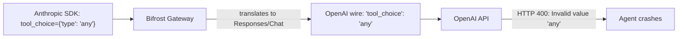

# 072, Bifrost forwards Anthropic `tool_choice: {"type": "any"}` as bare `"tool_choice": "any"` to OpenAI backends instead of mapping to `"required"`

- **Upstream**: no ticket found in `maximhq/bifrost`. Related issue [#4530](https://github.com/maximhq/bifrost/issues/4530) concerned server-side tools being stripped when `tool_choice: "required"` was used, not translation of the Anthropic `"any"` enum.
- **Tool under test**: Bifrost gateway **v2.0.0** (binary `bifrost-http-0`) and **v1.6.11** (`npx -y @maximhq/bifrost`).
- **Reproduced**: 2026-09-06 on macOS arm64. Keyless local OpenAI Responses/Chat capture backend (`transcripts/072/reproduce.py`). Five of five client calls returned HTTP 200, but the forwarded request carried the invalid dialect string `"any"`. Evidence: `transcripts/072/`.

## What breaks

In the Anthropic Messages API (`/anthropic/v1/messages`), an agent forces tool execution by setting:

```json
"tool_choice": {"type": "any"}
```

This specifies that the model must invoke at least one of the provided tools.

In the OpenAI API (both the Responses API `/v1/responses` and Chat Completions `/v1/chat/completions`), the equivalent requirement is specified by the string `"required"`:

```json
"tool_choice": "required"
```

OpenAI's schema allows only `"auto"`, `"none"`, `"required"`, or an explicit function object. The string `"any"` is not recognized by OpenAI and causes OpenAI to reject the request with HTTP 400 Bad Request:
`Invalid value: 'any'. Supported values are: 'auto', 'none', 'required', or an object.`

When Bifrost translates an Anthropic request to an OpenAI-compatible backend, it converts `tool_choice: {"type": "any"}` to `tool_choice: "any"` and transmits that string verbatim on the OpenAI wire. The Anthropic dialect string leaks into the OpenAI request without being mapped to `"required"`.

Who this hurts:

- Any agentic workflow (for example using the Anthropic Python or TypeScript SDK, Claude Code, or LangChain Anthropic integration) pointed at Bifrost and configured to route to an OpenAI model. When the agent enforces tool execution on step 1 using standard Anthropic syntax, the request fails with HTTP 400 from OpenAI rather than invoking the tool.



## Wire evidence

1. **Bifrost Anthropic ingress to OpenAI Responses upstream (5/5 violation)**
   - `transcripts/072/upstream-request.jsonl`
   - Five `/anthropic/v1/messages` calls with `"tool_choice": {"type": "any"}` resulted in forwarded `/v1/responses` requests containing `"tool_choice": "any"`.
2. **Control 1: Bifrost OpenAI Responses ingress (5/5 conformant)**
   - `transcripts/072/control-responses-upstream.jsonl`
   - Five `/v1/responses` calls with `"tool_choice": "required"` forwarded `"tool_choice": "required"` to the upstream.
3. **Control 2: Bifrost OpenAI Chat Completions ingress (5/5 conformant)**
   - `transcripts/072/control-chat-upstream.jsonl`
   - Five `/v1/chat/completions` calls with `"tool_choice": "required"` forwarded `"tool_choice": "required"` to the upstream.
4. **Control 3: Bifrost Anthropic auto tool_choice (5/5 conformant)**
   - `transcripts/072/control-anthropic-auto-upstream.jsonl`
   - Five `/anthropic/v1/messages` calls with `"tool_choice": {"type": "auto"}` forwarded `"tool_choice": "auto"` to the upstream.
5. **Determinism summary**
   - `transcripts/072/client-results.json` records 5/5 runs for each condition.

### Control matrix (5 iterations each)

| Route | Client sent | Reached upstream | Status |
|---|---|---|---|
| `/anthropic/v1/messages` | `"tool_choice": {"type": "any"}` | `"tool_choice": "any"` 5/5 | ❌ Dialect leak (expected `"required"`) |
| `/v1/responses` | `"tool_choice": "required"` | `"tool_choice": "required"` 5/5 | ✅ Conformant |
| `/v1/chat/completions` | `"tool_choice": "required"` | `"tool_choice": "required"` 5/5 | ✅ Conformant |
| `/anthropic/v1/messages` | `"tool_choice": {"type": "auto"}` | `"tool_choice": "auto"` 5/5 | ✅ Conformant |

## Bug or not

- **Is the expected behavior really the spec?**
  Yes. Anthropic specification documents `{"type": "any"}` as the mechanism to force tool use. OpenAI specification defines `"required"` as the mechanism to force tool use, and does not accept `"any"`. Furthermore, Bifrost's own reverse translator (`core/providers/anthropic/responses.go:8253`) already explicitly maps `ResponsesToolChoiceTypeRequired` to `&AnthropicToolChoice{Type: "any"}` when translating from OpenAI to Anthropic.
- **Have maintainers already ruled on it?**
  No. No maintainer commit, issue comment, or PR discusses preserving `"any"` on the OpenAI wire.
- **Is the trigger supported usage?**
  Yes. `tool_choice: {"type": "any"}` is standard Anthropic API usage across all official SDKs.
- **Is a real boundary crossed?**
  Yes. Protocol translation boundary from Anthropic Messages dialect to OpenAI Responses/Chat dialect. Leaking the unmapped string causes upstream provider rejection.
- **What fix would a maintainer ship?**
  In `core/providers/openai/responses.go` and `core/providers/openai/chat.go`, map `tool_choice` string `"any"` (or `ResponsesToolChoiceTypeAny`) to `"required"` when serializing requests for OpenAI.

Classification label: `bug`.

## Upstream status

Checked on 2026-09-06.

- Searched `maximhq/bifrost` issues, PRs, and commits for `tool_choice "any"` and `tool_choice "required"`.
- Found [#4530](https://github.com/maximhq/bifrost/issues/4530) and [#4532](https://github.com/maximhq/bifrost/pull/4532) regarding tool stripping with `tool_choice: "required"`, but no issue or PR exists for mapping `"any"` to `"required"`.
- Inspected `core/providers/openai/responses.go` and `core/providers/openai/chat.go` in Bifrost `dev` branch at commit `e1045c0`: `ToOpenAIResponsesRequest` assigns `req.ResponsesParameters = *params` with no mapping for `tool_choice: "any"`.
- Classification: `novel`.

## Root cause

In `core/providers/anthropic/responses.go`:
```go
func convertAnthropicToolChoiceToBifrost(toolChoice *AnthropicToolChoice) *schemas.ResponsesToolChoice {
...
    switch toolChoice.Type {
    case "auto":
        bifrostToolChoice.ResponsesToolChoiceStr = schemas.Ptr(string(schemas.ResponsesToolChoiceTypeAuto))
    case "any":
        bifrostToolChoice.ResponsesToolChoiceStr = schemas.Ptr(string(schemas.ResponsesToolChoiceTypeAny))
```
`ResponsesToolChoiceTypeAny` is defined in `core/schemas/responses.go` as `"any"`.

When `ToOpenAIResponsesRequest` in `core/providers/openai/responses.go` prepares the request for OpenAI:
```go
req.ResponsesParameters = *params
```
It leaves `ToolChoice` as `"any"`. Because `ResponsesToolChoice.MarshalJSON` outputs `ResponsesToolChoiceStr` directly, `"tool_choice": "any"` is sent to the OpenAI endpoint.

In contrast, `convertResponsesToolChoiceToAnthropic` in `core/providers/anthropic/responses.go:8253` correctly performs the reverse mapping:
```go
case schemas.ResponsesToolChoiceTypeAny, schemas.ResponsesToolChoiceTypeRequired:
    return &AnthropicToolChoice{Type: "any"}
```

## Test

Harness invariant: `anthropic_tool_choice_any_mapped_to_required`.

- `bifrost_leaks_anthropic_tool_choice_any` asserts violation on `transcripts/072/upstream-request.jsonl`.
- `bifrost_openai_responses_keeps_tool_choice_required` asserts conformant on `transcripts/072/control-responses-upstream.jsonl`.
- `bifrost_openai_chat_keeps_tool_choice_required` asserts conformant on `transcripts/072/control-chat-upstream.jsonl`.

Invariant: *an Anthropic `tool_choice: {"type": "any"}` constraint must be translated to `"tool_choice": "required"` when forwarded to an OpenAI-compatible backend, and must not leak the bare string `"any"`.*

## Repro

```bash
# Run deterministic 5/5 reproduction against local Bifrost:
python3 transcripts/072/reproduce.py

# Run unit tests for reproduction:
python3 -m unittest transcripts/072/test_reproduce.py
```
